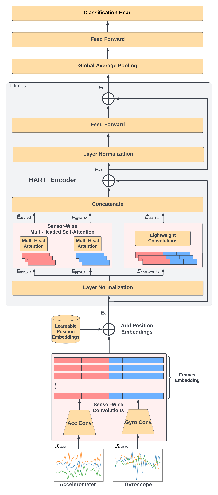

# Human Activity Recognition Transformer (HART) :heart:
Tensorflow implementation of **HART/MobileHART**:


**Lightweight Transformers for Human Activity Recognition on
Mobile Devices** [[Paper](https://arxiv.org/pdf/2209.11750.pdf)]

**Transformer-based Models to Deal with Heterogeneous Environments in Human Activity Recognition** [[Paper](https://link.springer.com/article/10.1007/s00779-023-01776-3)]

*[Sannara Ek](https://sannaraek.github.io/), [François Portet](https://lig-membres.imag.fr/portet/home.php), [Philippe Lalanda](https://lig-membres.imag.fr/lalanda/)*


<p align="center">
  
</p>

If our project is helpful for your research, please consider citing : 
``` 
@article{ek2023transformer,
  title={Transformer-based models to deal with heterogeneous environments in Human Activity Recognition},
  author={Ek, Sannara and Portet, Fran{\c{c}}ois and Lalanda, Philippe},
  journal={Personal and Ubiquitous Computing},
  pages={1--14},
  year={2023},
  publisher={Springer}
}
```


## Table of Content
* [1. Updates](#1-Updates)
* [2. Installation](#2-installation)
  * [2.1 Dependencies](#21-dependencies)
  * [2.2 Data](#22-data)
* [3. Quick Start](#3-quick-start)
  * [3.1 Importing HART or MobileHART to your project](#31-Importing-HART-or-MobileHART-to-your-project)
  * [3.2 Running HART in our provided pipeline](#32-Running-HART-in-our-provided-pipeline)
  * [3.3 Running MobileHART in our provided pipeline](#33-Running-MobileHART-in-our-provided-pipeline)
* [4. Position-Wise and Device-Wise Evaluation](#4-evaluation)
  * [4.1 Position-Wise evaluation with the RealWorld Dataset](#41-Position-Wise-evaluation-with-the-RealWorld-Dataset)
  * [4.2 Device-Wise evaluation with the HHAR Dataset](#42-Device-Wise-evaluation-with-the-HHAR-Dataset)
* [5. Results](#5-Results)
* [6. Acknowledgement](#5-acknowledgement)


## 1. Updates


***09/02/2023***
Initial commit: Code of HART/MobileHART is released.

***10/12/2024***
Update: HART now supports training on CPU and updated to work with TF 2.18

## 2. Installation
### 2.1 Dependencies

This code was developed with Python 3.7, Tensorflow 2.10.1 and CUDA 11.2. Please refer to [the official installation](https://www.tensorflow.org/install). If CUDA 11.2 has been properly installed : 
```
pip install tensorflow==2.10.1
```

While only Tensorflow and Numpy are required to import model.py to your working environment

To run our training and evaluatioin pipeline, additional dependecies are needed. please launch the following command:

```
pip install -r requirements.txt
```

Our baseline experiments were conducted on a Debian GNU/Linux 10 (buster) machine with the following specs:

CPU : Intel(R) Xeon(R) CPU E5-2623 v4 @ 2.60GHz

GPU : Nvidia GeForce Titan Xp 12GB VRAM

Memory: 80GB 


### 2.2 Data

We provide scripts to automate downloading and proprocessing the datasets used for this study.
See scripts in dataset folders. e.g, for the UCI dataset, run DATA_UCI.py

For running the 'Combined' dataset training and evaluation pipeline, all datasets must first be downloaded and processed.
Please run all scripts in the 'datasets' folder.

Tip: Manually downloading the datasets and placing them in the 'datasets/dataset' folder may be a good alternative for stability if the download pipeline keeps failing VIA the provided scripts.

UCI
```
https://archive.ics.uci.edu/ml/datasets/human+activity+recognition+using+smartphones
```

MotionSense
```
https://github.com/mmalekzadeh/motion-sense/tree/master/data
```

HHAR
```
http://archive.ics.uci.edu/ml/datasets/Heterogeneity+Activity+Recognition
```

RealWorld
```
https://www.uni-mannheim.de/dws/research/projects/activity-recognition/#dataset_dailylog
```

SHL Preview
```
http://www.shl-dataset.org/download/
```

## 3. Quick Start

After running all or the desired datasets for usage in the DATA scripts in the dataset folder, launch either the jupyter notebook or python script to start the training pipeline.

Sample launch commands provided in the following sections

### 3.1 Importing HART or MobileHART to your project

HART and MobileHART are packaged as a keras sequential model.

To use our models with their default hyperparameters, please import and add the following code:

```
import model 

input_shape = (128,6) # The shape of your input data
activityCount = 6 # Number of classification heads

HART = model.HART(input_shape,activityCount)
MobileHART = model.mobileHART_XS(input_shape,activityCount)
```

Then compile and fit with desired optimizer and loss as conventional keras model.


### 3.2 Running HART in our provided pipeline

To run with the default hyperparameters of HART for MotionSense dataset, please launch:

```
python main.py --architecture HART --dataset MotionSense --localEpoch 200 --batch_size 64
```

Replace 'MotionSense' with one of the below to train on different a dataset 

```
RealWorld, HHAR, UCI, SHL, MotionSense, COMBINED
```


### 3.3 Running MobileHART in our provided pipeline

To run with the default hyperparameters of MobileHART for MotionSense dataset 

```
python main.py --architecture MobileHART --dataset MotionSense --localEpoch 200 --batch_size 64
```

Replace 'MotionSense' with one of the below to train on different a dataset 

```
MotionSense,RealWorld,HHAR,UCI,SHL,MotionSense, COMBINED
```
## 4. Position-Wise and Device-Wise Evaluation
<!-- Following are the different steps to reproduce the results of **TokenCut** presented in the paper. -->

### 4.1 Position-Wise evaluation with the RealWorld Dataset

To run HART/MobileHART in a leave one position out pipeline with the RealWorld dataset, please launch:

```
python main.py --architecture HART --dataset RealWorld --positionDevice chest --localEpoch 200 --batch_size 64
```

Replace 'chest' with one of the below to test on different a position 

```
chest, forearm, head, shin, thigh, upperarm, waist
```
### 4.2 Device-Wise evaluation with the HHAR Dataset

To run HART/MobileHART in a leave one device out pipeline with the HHAR dataset, please launch:

```
python main.py --architecture HART --dataset HHAR --positionDevice nexus4 --localEpoch 200 --batch_size 64
```

Replace 'nexus4' with one of the below to test on different a device 

```
nexus4, lgwatch, s3, s3mini, gear, samsungold
```

## 5. Results

The table below shows the results obtained with HART and MobileHART on our training and evaluation pipeline with the 5 and combined datasets.

<table>
  <tr>
    <th>Architecture</th>
    <th>UCI</th>
    <th>MotionSense</th>
    <th>HHAR</th>
    <th>RealWorld</th>
    <th>SHL</th>
    <th>Combined</th>
  </tr>
  <tr>
    <td>HART</td>
    <td>94.49</td>
    <td>98.20</td>
    <td>97.36</td>
    <td>94.88</td>
    <td>79.49</td>
    <td>85.61</td>
  <tr>
  <tr>
    <td>MobileHART</td>
    <td>97.20</td>
    <td>98.45</td>
    <td>98.19</td>
    <td>95.22</td>
    <td>81.36</td>
    <td>86.74</td>
  </tr>
</table>

The image below shows the result of our sensor-wise attention compared againts conventional attention:

<p align="center">
  
</p>

## 6. Acknowledgement

This work has been partially funded by Naval Group, and by MIAI@Grenoble Alpes (ANR-19-P3IA-0003). This work was also granted access to the HPC resources of IDRIS under the allocation 2022-AD011013233 made by GENCI.

